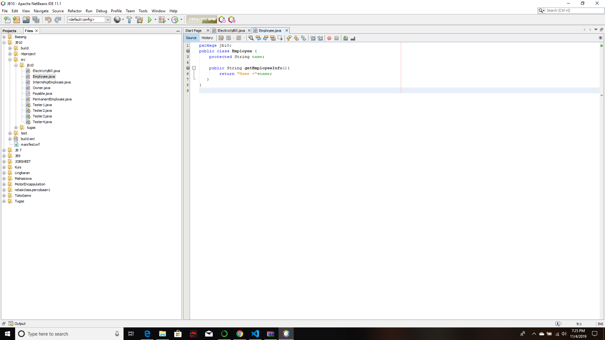
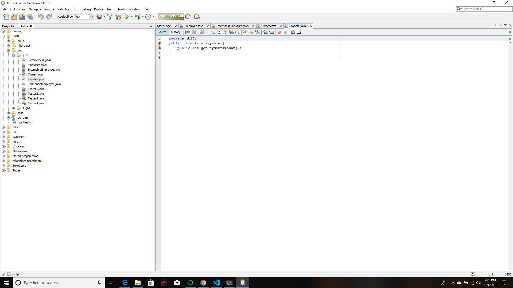
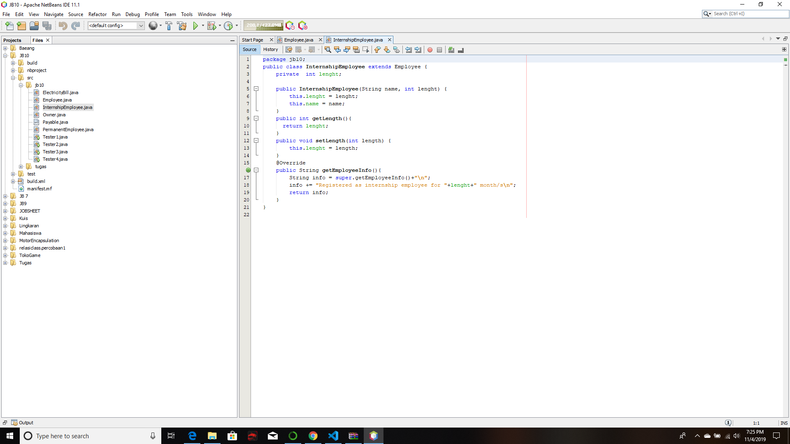
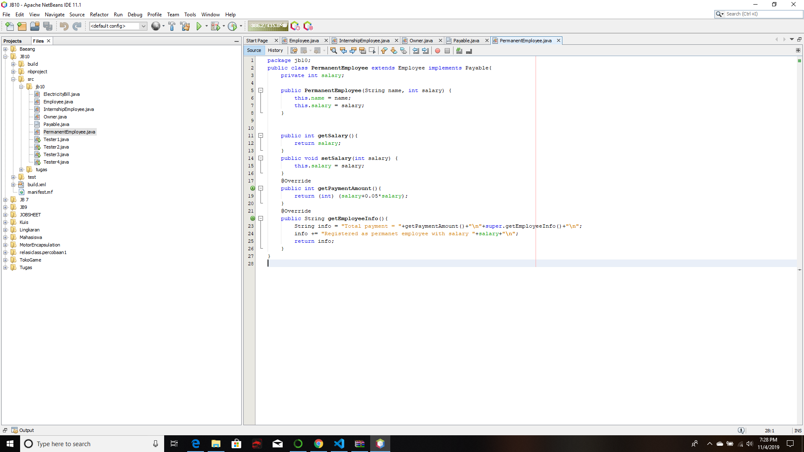
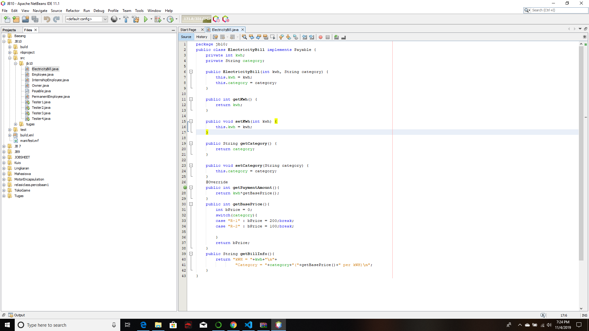
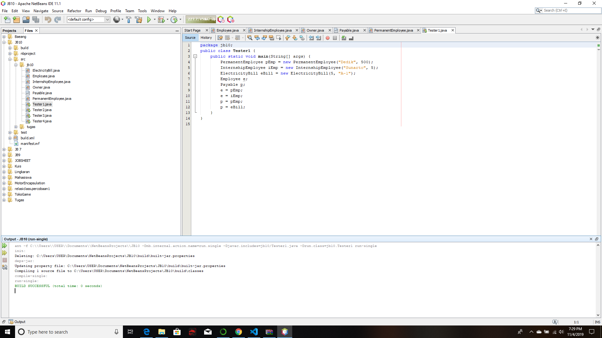
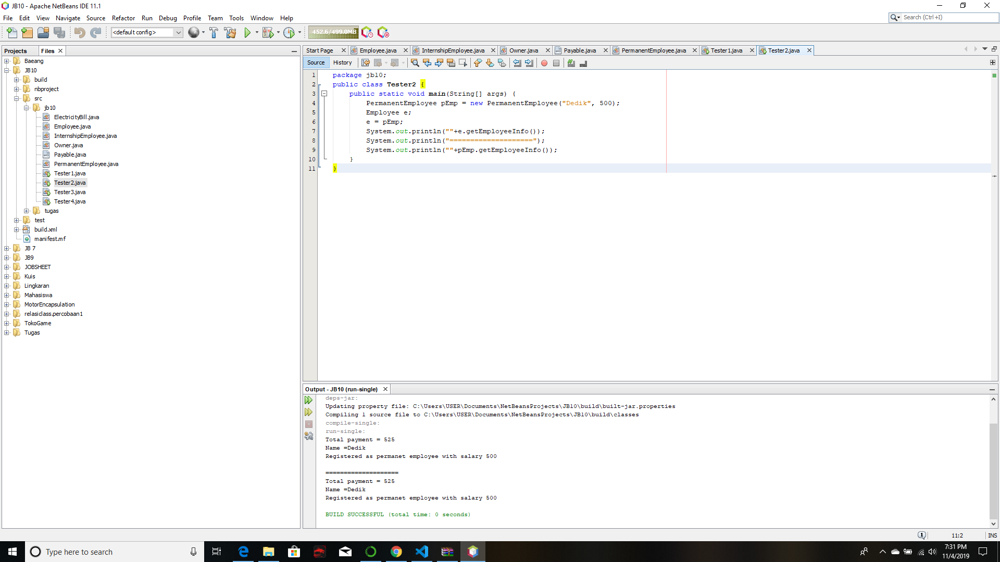
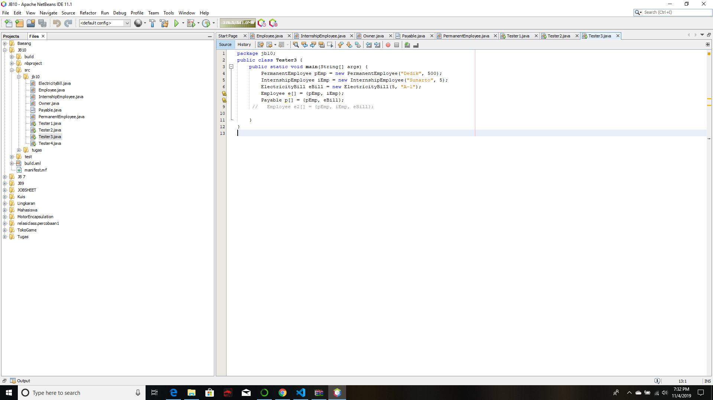
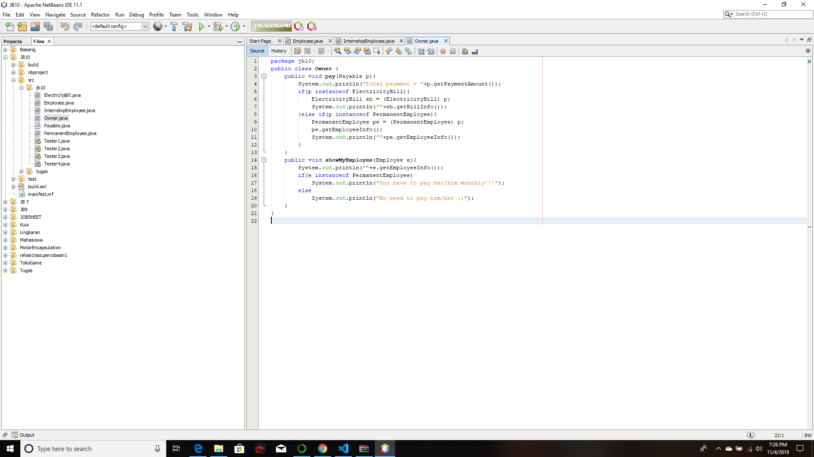
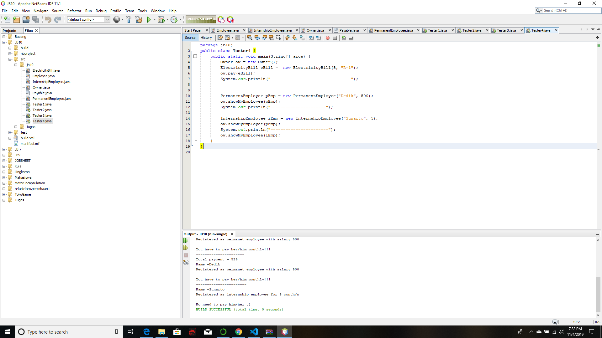

# Laporan Praktikum #10 - POLIMORFISME 
## Kompetensi
Setelah melakukan percobaan pada jobsheet ini, diharapkan mahasiswa mampu: 
a. Memahami konsep dan bentuk dasar polimorfisme                                      b. Memahami konsep virtual method invication 
c. Menerapkan polimorfisme pada pembuatan heterogeneous collection 
d. Menerapkan polimorfisme pada parameter/argument method 
e. Menerapkan object casting untuk meng-ubah bentuk objek 

## Ringkasan Materi
Polimorfisme merupakan kemampuan suatu objek untuk memiliki banyak bentuk. Penggunaan polimorfisme yang paling umum dalam OOP terjadi ketika ada referensi super class yang digunakan untuk merujuk ke objek dari sub class. Dengan kata lain, ketika ada suatu objek yang dideklarasikan dari super class, maka objek tersebut bisa diinstansiasi sebagai objek dari sub class. Dari uraian tersebut bisa dilihat bahwa konsep polimorfisme bisa diterapkan pada class-class yang memiliki relasi inheritance (relasi generalisasi atau IS-A). 

Selain pada class-class yang memiliki relasi inheritance, polimorfisme juga bisa diterapkan pada interface. Ketika ada objek yang dideklarasikan dari suatu interface, maka ia bisa digunakan untuk mereferensi ke objek dari class-class yang implements ke interface tersebut. 

## 4 Percobaan 1 - Bentuk dasar polimorfisme

### 4.1 Langkah Percobaan

! [ini  link ke kode program](src/10_Polimorfisme/Employee.java)

! [ini  link ke kode program](src/10_Polimorfisme/Payable.java)

! [ini  link ke kode program](src/10_Polimorfisme/Internship.java)

! [ini  link ke kode program](src/10_Polimorfisme/PermanentEmployee.java)

! [ini  link ke kode program](src/10_Polimorfisme/ElectriccityBill.java)

! [ini  link ke kode program](src/10_Polimorfisme/Tester1.java)

## 4.2 Pertanyaan
1. Class apa sajakah yang merupakan turunan dari class Employee? 
2. Class apa sajakah yang implements ke interface Payable? 
3. Perhatikan class Tester1, baris ke-10 dan 11. Mengapa e, bisa diisi dengan objek pEmp (merupakan objek dari class PermanentEmployee) dan objek iEmp (merupakan objek dari class InternshipEmploye) ? 
4. Perhatikan class Tester1, baris ke-12 dan 13. Mengapa p, bisa diisi dengan objek pEmp (merupakan objek dari class PermanentEmployee) dan objek eBill (merupakan objek dari class ElectricityBill) ? 
5. Coba tambahkan sintaks: p = iEmp;      e = eBill; pada baris 14 dan 15 (baris terakhir dalam method main) ! Apa yang menyebabkan error? 
6. Ambil kesimpulan tentang konsep/bentuk dasar polimorfisme! 

## Jawaban

1. Class yang merupakan turunan dari class Employee adalah:
InternshipEmployee
PermanentEmployee
2. Class yang mengimplements dari interface Payable adalah:
PermanentEmployee
ElectriccityBill
3. Karena e bertipe Employee bisa digunakan untuk mereferensi ke objek iEmp yaitu objek dari class InternshipEmployee dan PermanentEmployee yang merupakan turunan dari class Employee.
4. Karena p bertipe Payable bisa digunakan untuk mereferensi ke objek pEmp dan eBill yaitu objek dari class PermanentEmployee dan ElectriccityBill yang mengimplements interface Payable
5. Error tersebut disebabkan karena class ElectriccityBill bukan turunan dari class Employee dan iEmp tidak mengimplements interface Payable.
6. Polimorfisme merupakan kemampuan suatu objek untuk memiliki banyak bentuk.

## 5 Percobaan 2 - Virtual method invocation

## 5.1 Langkah Percobaan

! [ini  link ke kode program](src/10_Polimorfisme/Tester2.java)

## 5.2 Pertanyaan
1. Perhatikan class Tester2 di atas, mengapa pemanggilan e.getEmployeeInfo() pada baris 8 dan pEmp.getEmployeeInfo() pada baris 10 menghasilkan hasil sama? 
2. Mengapa pemanggilan method e.getEmployeeInfo() disebut sebagai pemanggilan method virtual (virtual method invication), sedangkan pEmp.getEmployeeInfo() tidak? 
3. Jadi apakah yang dimaksud dari virtual method invocation? Mengapa disebut virtual? 

## Jawaban
1. Karena e bertipe Employee telah mereferensi objek yaitu objek dari class PermanentEmployee dan e telah digunakan untuk memanggil method getEmployeeInfo() yang sebenernya saat di compile time tetap dikenali sebagai method dari class Employee tetapi pada saat run time method tersebut dijalankan dari class PermanentEmployee yang mengOverride dari class Employee
2. Karena e telah digunakan untuk memanggil method getEmployeeInfo() yang sebenernya saat compile time tetap dikenali sebagai method dari class Employee tetapi pada saat run time method tersebut dijalankan dari class PermanentEmployee yang mengoverride dari class Employee dan disebut sebagai Virtual method Invocation
3. Virtual method invocation adalah ketika ada pemanggilan overriding method dari suatu objek polimorfisme dan disebut virtual karena antara method yang dikenali oleh compiler dan method yang dijalankan oleh JVM berbeda. 

## 6 Percobaan 3 - Heterogenous Collection

## 6.1 Langkah Percobaan

! [ini  link ke kode program](src/10_Polimorfisme/Tester3.java)

## 6.2 Pertanyaan
1.  Perhatikan array e pada baris ke-8, mengapa ia bisa diisi dengan objek-objek dengan tipe yang berbeda, yaitu objek pEmp (objek dari PermanentEmployee) dan objek iEmp (objek dari InternshipEmployee) ? 
2. Perhatikan juga baris ke-9, mengapa array p juga biisi dengan objekobjek dengan tipe yang berbeda, yaitu objek pEmp (objek dari PermanentEmployee) dan objek eBill (objek dari ElectricityBilling) ? 
3. Perhatikan baris ke-10, mengapa terjadi error? 

## Jawaban
1. Hal tersebut bisa terjadi karena array e[] dideklarasikan dari class Employee yang merupakan super class PermanentEmployee dan class InternshipEmployee
2. Hal tersebut bisa terjadi karena array p[] dideklarasikan dari interface Payable, dan karena class PermanentEmployee dan ElectriccityBill mengimplements interface Payable maka array p[] bisa diisi dengan objek objek tersebut
3. karena class ElectriccityBill tidak memiliki hubungan apapun dengan class Employee.

# 6 Percobaan 4 - Argumen polimorfisme, instanceod dan casting objek

## 7.1 Langkah Percobaan

! [ini  link ke kode program](src/10_Polimorfisme/Owner.java)

! [ini  link ke kode program](src/10_Polimorfisme/Tester4.java)

## 7.2 Pertanyaan
1. Perhatikan class Tester4 baris ke-7 dan baris ke-11, mengapa pemanggilan ow.pay(eBill) dan ow.pay(pEmp) bisa dilakukan, padahal jika diperhatikan method pay() yang ada di dalam class Owner memiliki argument/parameter bertipe Payable? Jika diperhatikan lebih detil eBill merupakan objek dari ElectricityBill dan pEmp merupakan objek dari PermanentEmployee?
2. Jadi apakah tujuan membuat argument bertipe Payable pada method pay() yang ada di dalam class Owner? 
3. Coba pada baris terakhir method main() yang ada di dalam class Tester4 ditambahkan perintah ow.pay(iEmp); 
4. Perhatikan class Owner, diperlukan untuk apakah sintaks p instanceof ElectricityBill pada baris ke-6 ? 
5. Perhatikan kembali class Owner baris ke-7, untuk apakah casting objek disana (ElectricityBill eb = (ElectricityBill) p) diperlukan ? Mengapa objek p yang bertipe Payable harus di-casting ke dalam objek eb yang bertipe ElectricityBill ? 

## Jawaban
1. karena argument dari method pay merupakan interface Payable, maka dari itu dikarenakan ke-2 class tersebut mengimplements interface Payable dan dikarenakan hal tersebut method pay bisa diisi dengan objek dari ke-2 class tersebut
2. Agar method pay dapat menerima argument dari berbagai objek yang berasal dari class yang mengimplementnya
3. Error disebabkan karena argument pada method pay tidak memiliki hubungan apapun dengan class InternshipEmployee
4. p diperlukan untuk hasil instaceof yang berupa boolean yaitu p, yang akan di gunakan untuk mengecek apakah suatu objek merupakan hasil instansiasi dari suatu class tertentu
5. Diperlukan, karena objek p yang bertipe payable merupakan superclass akan di ubah ke objek eb yang merupakan subclass

## Kesimpulan
saya dapat memahami konsep dasar polimorfisme dan juga dapat membuat class dari kehidupan sehari hari

## Pernyataan Diri

Saya menyatakan isi tugas, kode program, dan laporan praktikum ini dibuat oleh saya sendiri. Saya tidak melakukan plagiasi, kecurangan, menyalin/menggandakan milik orang lain.

Jika saya melakukan plagiasi, kecurangan, atau melanggar hak kekayaan intelektual, saya siap untuk mendapat sanksi atau hukuman sesuai peraturan perundang-undangan yang berlaku.

Ttd,

***(Alief Faizal Imansyah)***