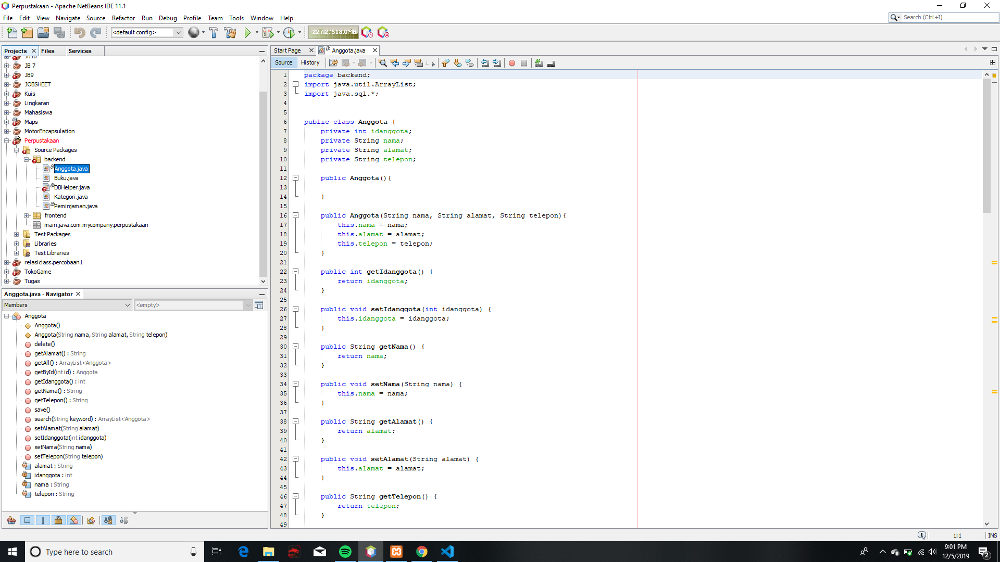
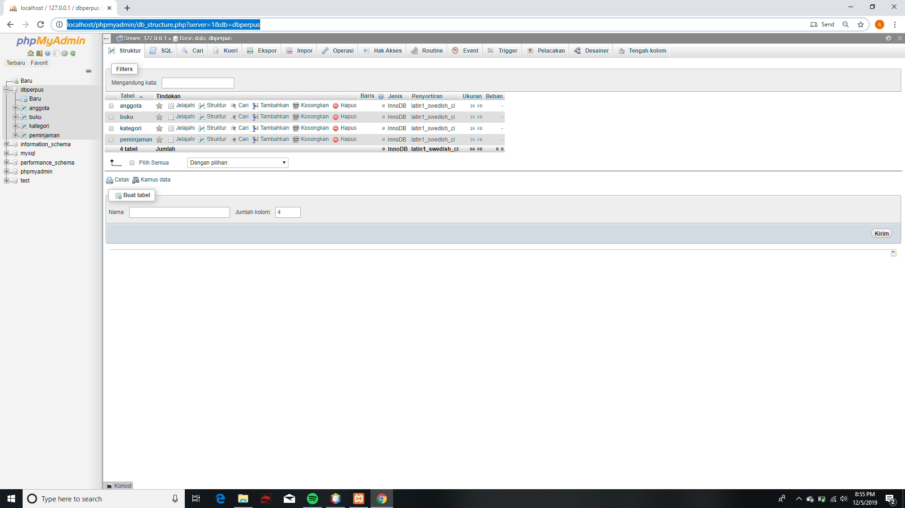
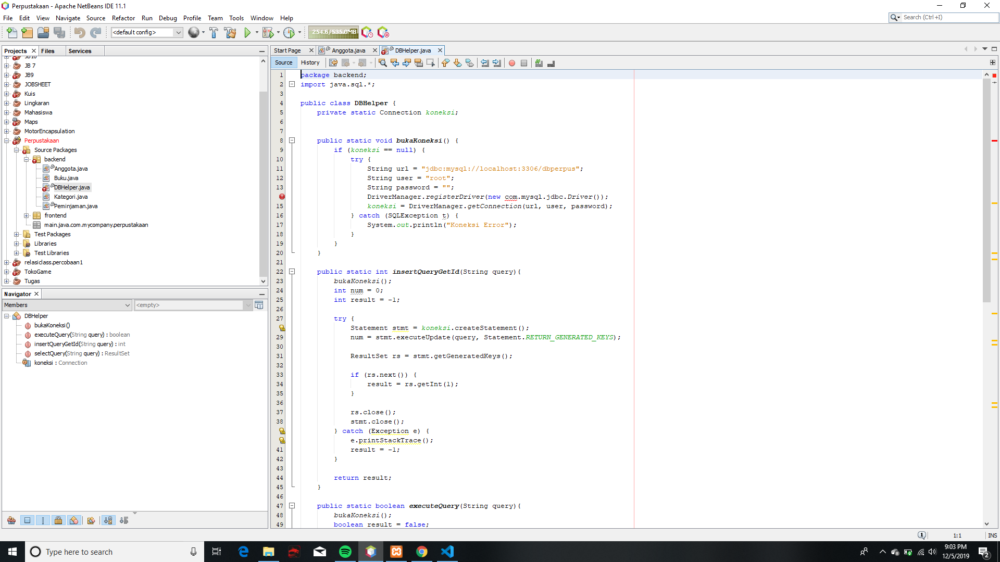
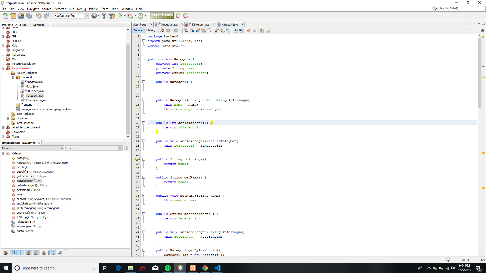
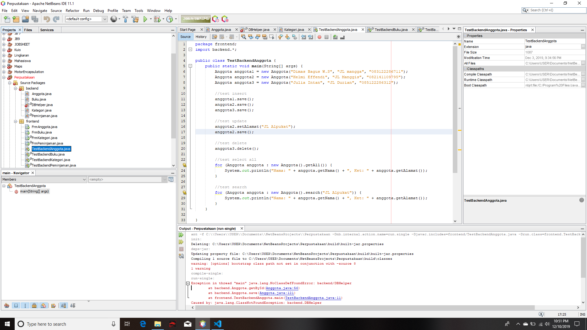
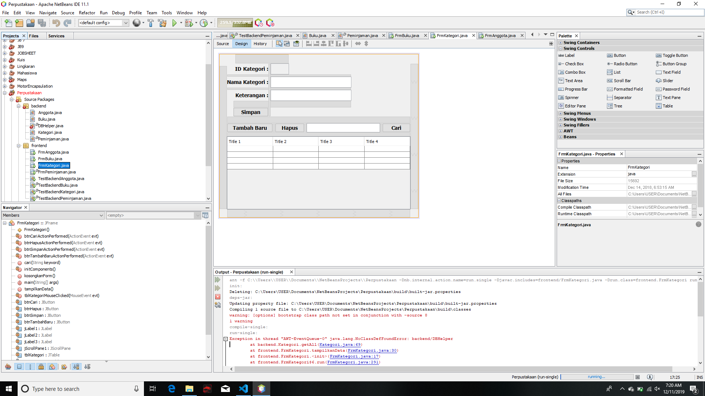
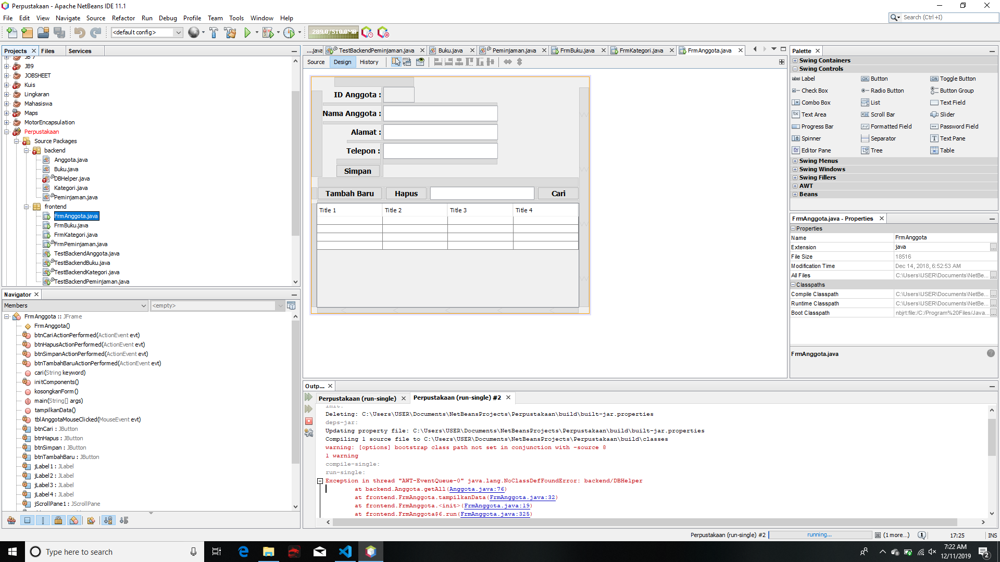
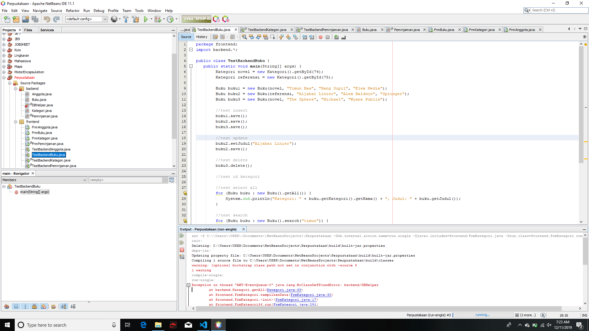
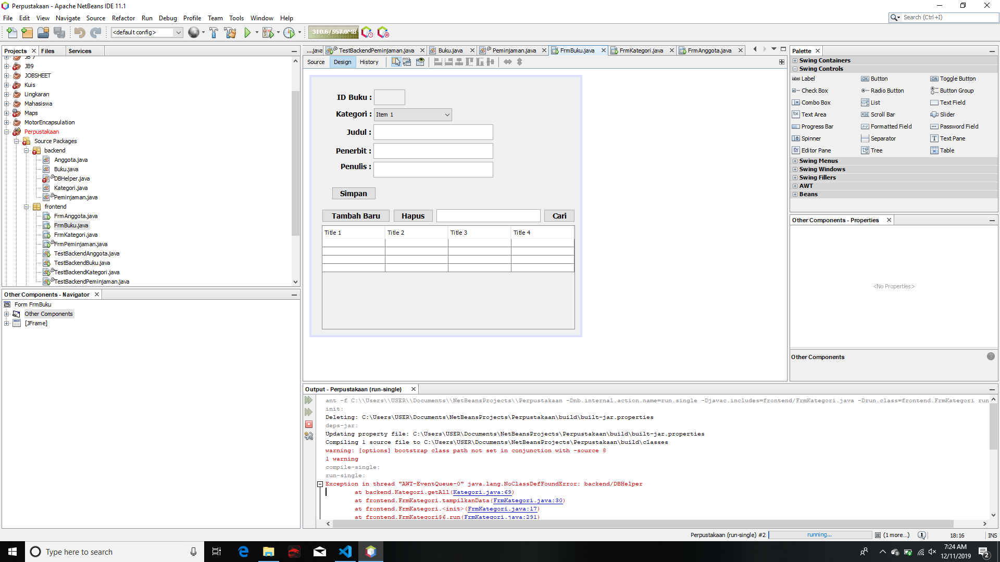
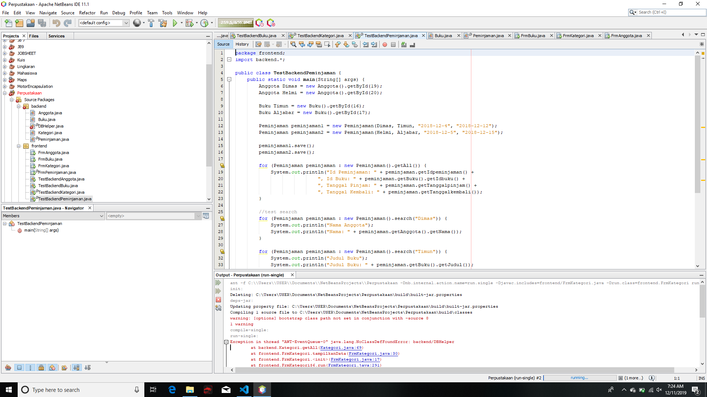

# Laporan Praktikum #12 - Collection (List, Set, Map) dan Database  

## Uji Kompetensi

Setelah menempuh materi percobaan ini, mahasiswa mampu mengenal:
1. Menggunakan paradigma berorientasi objek untuk interaksi dengan database
2. Membuat backend dan frontend
3. Membuat form sebagai frontend
 

## Ringkasan Materi
Kali ini kita akan menggunakan paradigma berorientasi objek yang telah kita pelajari untuk membuat
aplikasi berbasis database dan dilengkapi dengan form sebagai Graphical User Interface (GUI).
Secara umum, tahapan yang akan kita lakukan adalah sebagai berikut :
1. Membuat database dan tabel-tabelnya.
2. Membuat backend yang berisi class-class yang mewakili data yang ada pada database, dan
class helper untuk melakukan eksekusi query database.
3. Membuat frontend yang merupakan antarmuka kepada pengguna. Frontend ini bisa
berbasis teks (console), GUI, web, mobile, dan sebagainya.

Library yang digunakan untuk project ini antara lain :
1. JDBC, untuk melakukan interaksi ke database.
2. ArrayList, untuk menampung data hasil query ke database.
3. Swing, untuk membuat tampilan GUI.

## Percobaan

### Percobaan 1
Membuat database.
1. Langkah pertama untuk percobaan ini adalah membuat database. Install XAMMP, buka phpMyAdmin, buat database dbperpus, dan tabel-tabelnya:

    Set semua primary key id pada tiap tabel (idanggota, idkategori, idpeminjaman, idbuku) dengan Auto Increment

### Percobaan 2
Mempersiapkan project.

1. Buat Project baru, beri nama Perpustakaan
2. Pada project explorer, klik kanan pada Libraries --> Add Library, pilih MySQL JDBC Drive.
3. Buat package frontend dan backend. Cara membuat package adalah, pada project explorer, klik kanan pada source packages --> New --> Java Package, beri nama package nya (frontend, backend)

 

### Percobaan 3
Membuat class helper untuk mengeksekusi query SQL.

1. Pada Package backend, buat class DBHelper.
2. import java.sql.*
3. Di dalam kelas ini ada method-method antara lain

link kode program: 

[DBHelper.java](../../src/14_GUI_dan_Database/DBHelper.java)

### Percobaan 4
Membuat class Kategori untuk menghandle CRUD pada tabel kategori.

link kode program: 

[Kategori.java](../../src/14_GUI_dan_Database/Kategori.java)

### Percobaan 5
Mencoba backed yang sudah dibuat dengan mengoperasikannya lewat frontend berbasis teks (console). Percobaan ini dapat anda skip jika anda telah yakin bahwa backend yang anda buat sudah berfungsi dengan baik. 

link kode program: 

[TestBackend.java](../../src/14_GUI_dan_Database/TestBackend.java)

### Percobaan 6
### Percobaan 6.1
Pada percobaan ini kita akan membuat interface GUI untuk class Kategori. 

link kode program: 

[FrmKategori.java](../../src/14_GUI_dan_Database/FrmKategor.java)

### Percobaan 6.2

Lakukan hal yang sama untuk data Anggota!
1. Buat class Anggota pada package backend, lengkapi atribut dan method-nya.
2. Lakukan test pada class TestBackend pada package frontend

link kode program: 

[Anggota.java](../../src/14_GUI_dan_Database/Anggota.java)

[TestBackendAnggota.java](../../src/14_GUI_dan_Database/TestBackendAnggota.java)

### Percobaan 7
### Percobaan 7.1
Buat form untuk data Anggota.
1. Buat FrmAnggota pada package frontend dan lengkapi komponen, method serta event-nya.

link kode program :

[FrmAnggota.java](../../src/14_GUI_dan_Database/FrmAnggota.java)

### Percobaan 7.2
Untuk data Buku, caranya kurang lebih sama seperti data Kategori dan Anggota. Hanya saja yang
berbeda adalah:
1.  Pemanggilan getKategori().getIdKategori() pada query insert dan update untuk mengeset idkategori pada tabel buku.

2. Query select yang melibatkan join table pada method getById(), getAll() dan search().

link kode program: 

[Buku.java](../../src/14_GUI_dan_Database/Buku.java)

[TestBackendBuku.java](../../src/14_GUI_dan_Database/TestBackendBuku.java)

### Percobaan 8
Membuat GUI untuk data Buku, yang dilengkapi dengan combo box untuk memilih kategori yang terhubung dengan tabel kategori.

link kode program: 

[FrmBuku.java](../../src/14_GUI_dan_Database/FrmBuku.java)

## Tugas
1. Buatlah class Peminjaman.

[Peminjaman.java](../../src/14_GUI_dan_Database/Peminjaman.java)

[TestBackendPeminjaman.java](../../src/14_GUI_dan_Database/TestBackendPeminjaman.java)

2. Buatlah form FrmPeminjaman.

[FrmPeminjaman.java](../../src/14_GUI_dan_Database/FrmPeminjaman.java)

## Kesimpulan

Kita membutuhkan JDBC (Java Data Base Connectivity) untuk menghubungkan Java dan MySQL.

JDBC bertugas menyediakan koneksi ke database, sehingga kita bisa mengakses dan mengelola datanya dari program Java.

## Pernyataan Diri

Saya menyatakan isi tugas, kode program, dan laporan praktikum ini dibuat oleh saya sendiri. Saya tidak melakukan plagiasi, kecurangan, menyalin/menggandakan milik orang lain.

Jika saya melakukan plagiasi, kecurangan, atau melanggar hak kekayaan intelektual, saya siap untuk mendapat sanksi atau hukuman sesuai peraturan perundang-undangan yang berlaku.

Ttd,

***(Alief Faizal Imansyah)***