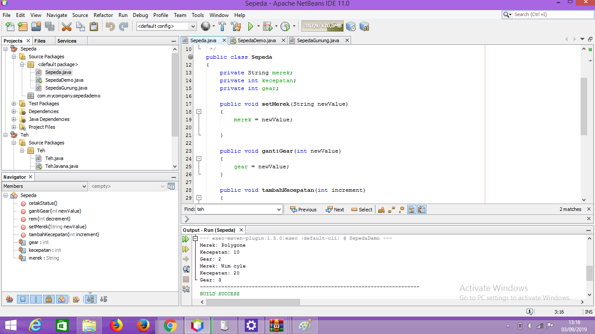
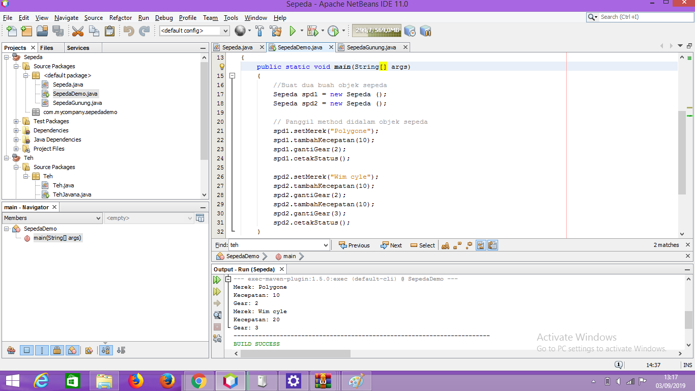
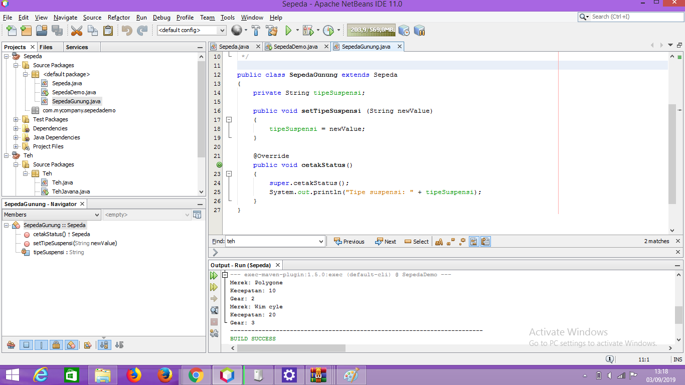

# Laporan Praktikum #1 - Pengantar Konsep PBO

## Kompetensi

(ketiklah kompetensi tiap praktikum di sini)

## Ringkasan Materi

(berisi catatan penting pribadi selama praktikum berlangsung ataupun menemukan permasalahan khusus saat melakukan percobaan)

## Percobaan

### Percobaan 1

Ini kode Project Sepeda

`contoh screenshot yang benar, menampilkan 3 komponen, yaitu struktur project, kode program, dan hasil kompilasi`

Contoh link kode program : [ini contoh link ke kode program](../../src/sepeda.java)
2. ini kode sepedaDemo 

Contoh link kode program : [ini contoh link ke kode program](../../src/sepedaDemo.java)

### Percobaan 2

ini kode sepedaGunung

`contoh screenshot yang benar, menampilkan 3 komponen, yaitu struktur project, kode program, dan hasil kompilasi`

Contoh link kode program : [ini contoh link ke kode program](../../src/sepedaGunung.java)

## Pertanyaan

1. Sebutkan dan jelaskan aspek-aspek yang ada pada pemrograman berorientasi objek! 
    Pemrograman berorientasi objek (Inggris: object-oriented programming disingkat OOP) merupakan paradigma pemrograman berdasarkan konsep "objek", yang dapat berisi data, dalam bentuk field atau dikenal juga sebagai atribut; serta kode, dalam bentuk fungsi/prosedur atau dikenal juga sebagai method. Semua data dan fungsi di dalam paradigma ini dibungkus dalam kelas-kelas atau objek-objek. Bandingkan dengan logika pemrograman terstruktur. Setiap objek dapat menerima pesan, memproses data, dan mengirim pesan ke objek lainnya,
Model data berorientasi objek dikatakan dapat memberi fleksibilitas yang lebih, kemudahan mengubah program, dan digunakan luas dalam teknik peranti lunak skala besar. Lebih jauh lagi, pendukung OOP mengklaim bahwa OOP lebih mudah dipelajari bagi pemula dibanding dengan pendekatan sebelumnya, dan pendekatan OOP lebih mudah dikembangkan dan dirawat 
aspeknya
Kelas — kumpulan atas definisi data dan fungsi-fungsi dalam suatu unit untuk suatu tujuan tertentu.
Objek - membungkus data dan fungsi bersama menjadi suatu unit dalam sebuah program komputer;
Abstraksi - Kemampuan sebuah program untuk melewati aspek informasi yang diproses olehnya, yaitu kemampuan untuk memfokus pada inti
Enkapsulasi - Memastikan pengguna sebuah objek tidak dapat mengganti keadaan dalam dari sebuah objek dengan cara yang tidak layak
Polimorfisme melalui pengiriman pesan. Tidak bergantung kepada pemanggilan subrutin, bahasa orientasi objek dapat mengirim pesan
2. Apa yang dimaksud dengan object dan apa bedanya dengan class? 
Objek - membungkus data dan fungsi bersama menjadi suatu unit dalam sebuah program komputer; objek merupakan dasar dari modularitas dan struktur dalam sebuah program komputer berorientasi objek.
3. Sebutkan salah satu kelebihan utama dari pemrograman berorientasi objek dibandingkan
   dengan pemrograman struktural! 
   Cara pandang PBO : Program bukan urut – urutan instruksi tapi diselesaikan oleh objek – objek yang bekerjasama untuk menyelesaikan masalah
4. Pada class Sepeda, terdapat state/atribut apa saja? 
Pada class Sepeda, terdapat state/atribut ada merek, kecepatan, gear dan warna
5. Tambahkan atribut warna pada class Sepeda. 
6. Mengapa pada saat kita membuat class SepedaGunung, kita tidak perlu membuat class nya dari
nol? 
6.	karena kita sudah membuat mewariskan class sepeda kepada sepeda gunung

## Tugas

(silakan kerjakan tugas di sini beserta `screenshot` hasil kompilasi program. Jika ada rujukan ke file program, bisa dibuat linknya di sini.)

`contoh screenshot yang benar, menampilkan 3 komponen, yaitu struktur project, kode program, dan hasil kompilasi`

Contoh link kode program : [ini contoh link ke kode program](../../src/1_Pengantar_Konsep_PBO/Contoh12345Habibie.java)

## Kesimpulan

(Berisi simpulan yang telah diperoleh selama praktikum atau belajar pada pertemuan ini)

## Pernyataan Diri

Saya menyatakan isi tugas, kode program, dan laporan praktikum ini dibuat oleh saya sendiri. Saya tidak melakukan plagiasi, kecurangan, menyalin/menggandakan milik orang lain.

Jika saya melakukan plagiasi, kecurangan, atau melanggar hak kekayaan intelektual, saya siap untuk mendapat sanksi atau hukuman sesuai peraturan perundang-undangan yang berlaku.

Ttd,

***(silakan isi nama lengkap di sini)***
