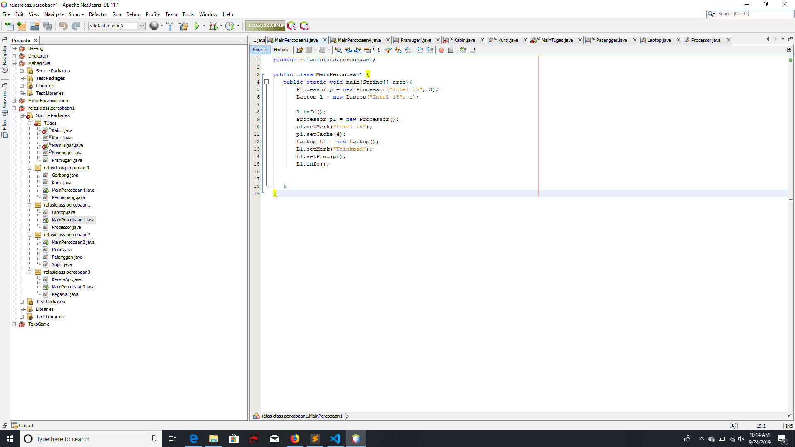
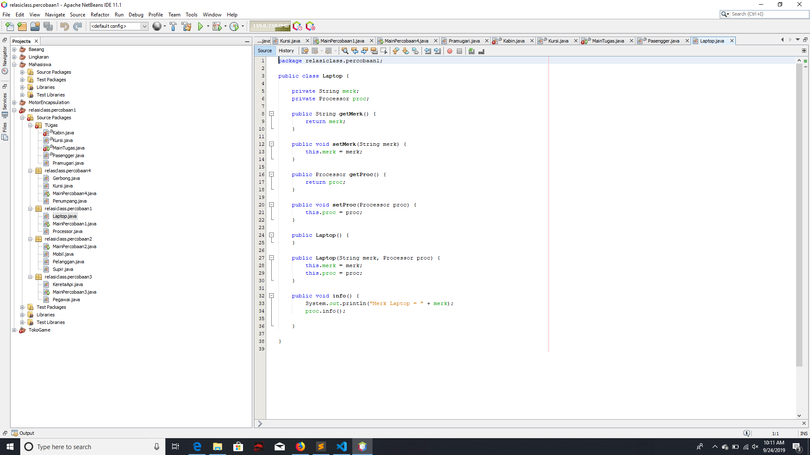
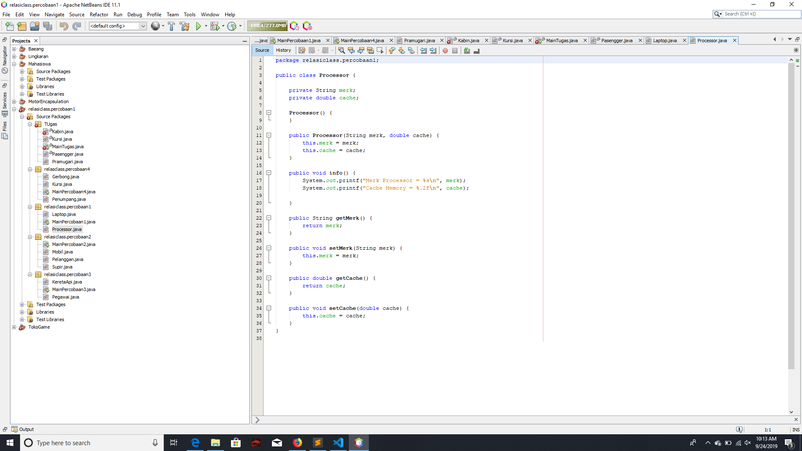
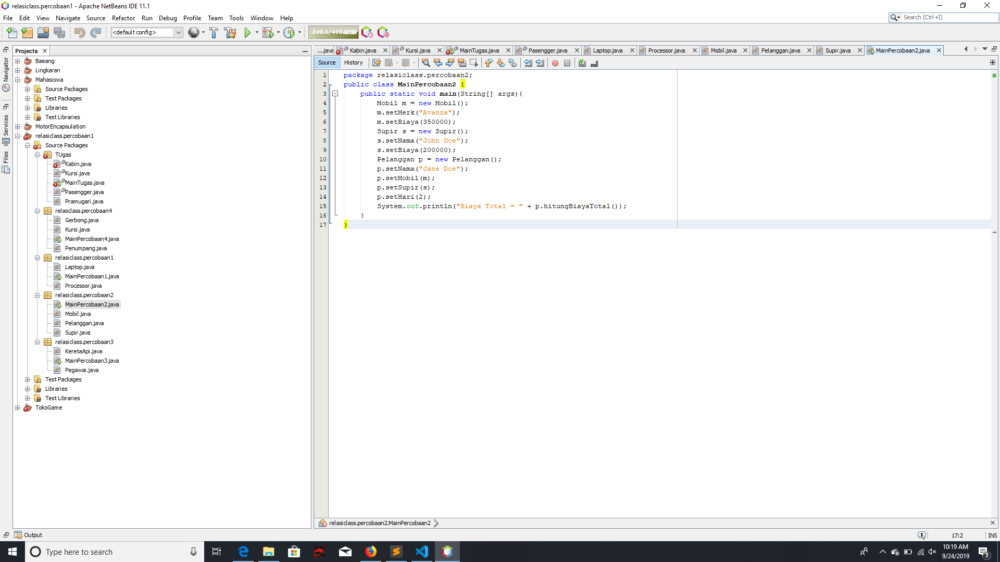
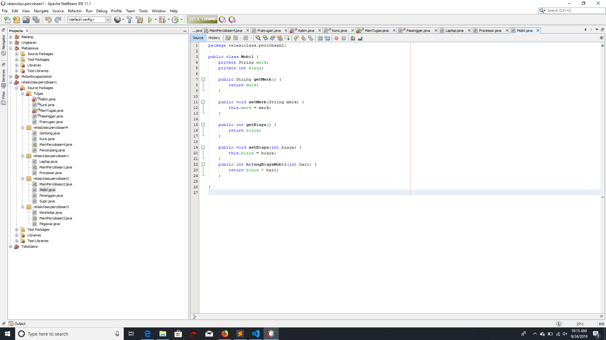
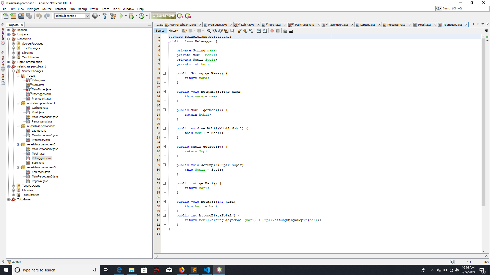
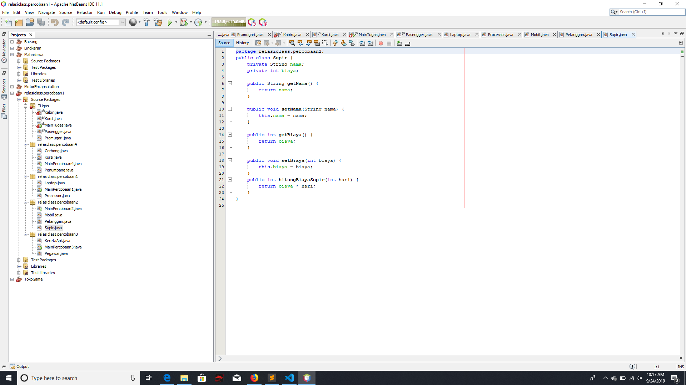
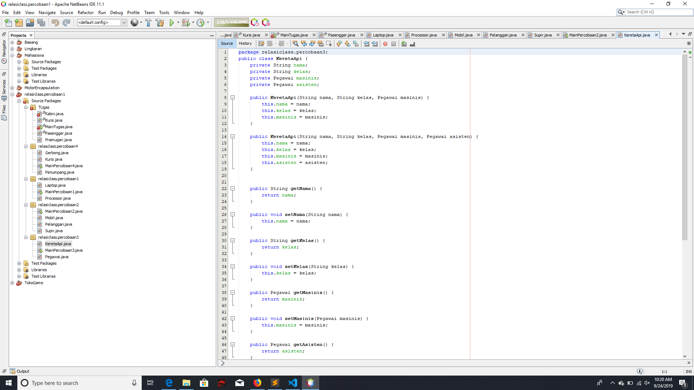
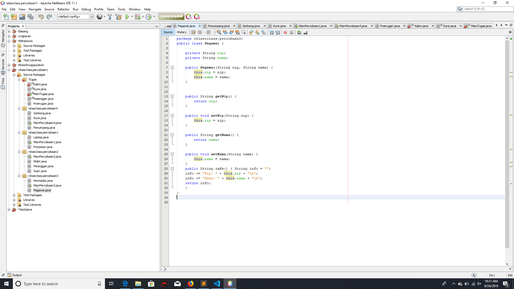

# Laporan Praktikum #4 - Relasi Class

## Kompetensi
Setelah menempuh pokok bahasan ini, mahasiswa mampu:
1. Memahami konsep relasi kelas;
2. Mengimplementasikan relasi has-a dalam program

## Ringkasan Materi

Pada kasus yang lebih kompleks, dalam suatu sistem akan ditemukan lebih dari satu class yang saling memiliki keterkaitan antara class satu dengan yang lain. Misalnya terdapat class Laptop yang memiliki atribut berupa merek dan prosesor. Jenis realasi has-a ini yang akan dicontohkan pada percobaan di jobsheet ini.

## Praktikum

### Percobaan 1

a. Perhatikan diagram class berikut:

b. Buka project baru di Netbeans dan buat package dengan format berikut: .relasiclass.percobaan1 (ganti dengan identitas anda atau nama domain), Contoh: ac.id.polinema, jti.polinema, dan sebagainya). 

Catatan: Penamaan package dengan tambahan identifier untuk menghindari adanya kemungkinan penamaan class yang bentrok. 
 
c. Buatlah class Processor dalam package tersebut. 
 
public class Processor { 
 
} 
 
d. Tambahkan atribut merk dan cache pada class Processor dengan akses modifier private . 
 
private String merk; private double cache; 
 
e. Buatlah constructor default untuk class Processor. 
 
f. Buatlah constructor untuk class Processor dengan parameter merk dan cache. 
 
g. Implementasikan setter dan getter untuk class Processor. 
 
h. Implementasikan method info() seperti berikut: 
 
public void info() { System.out.printf("Merk Processor = %s\n", merk); System.out.printf("Cache Memory = %.2f\n", cache); } 
 
i. Kemudian buatlah class Laptop di dalam package yang telah anda buat. 
 
j. Tambahkan atribut merk dengan tipe String dan proc dengan tipe Object Processor 
 
private String merk; private Processor proc;  
 
k. Buatlah constructor default untuk class Laptop . 
 
l. Buatlah constructor untuk class Laptop dengan parameter merk dan proc . 
 
m. Selanjutnya implementasikan method info() pada class Laptop sebagai berikut 
 
public void info() { System.out.println("Merk Laptop = " + merk); proc.info(); } 
 
n. Pada package yang sama, buatlah class MainPercobaan1 yang berisi method main(). 
 
o. Deklarasikan Object Processor dengan nama p kemudian instansiasi dengan informasi atribut Intel i5 untuk nilai merk serta 3 untuk nilai cache . 
 
Processor p = new Processor("Intel i5", 3); 
 
p. Kemudian deklarasikan serta instansiasi Objek Laptop dengan nama L dengan informasi atribut Thinkpad dan Objek Processor yang telah dibuat. 
 
q. Panggil method info() dari Objek L. 
 
L.info(); 
 
r. Tambahkan baris kode berikut 
 
Processor p1 = new Processor(); p1.setMerk("Intel i5"); p1.setCache(4); Laptop L1 = new Laptop(); L1.setMerk("Thinkpad"); L1.setProc(p1); L1.info(); 
 
s. Compile kemudian run class MainPercobaan1, akan didapatkan hasil seperti berikut: 

 link kode program : [ini link ke kode program](../../src/4_Relasi_Class_/MainPercobaan1.java)

 link kode program : [ini link ke kode program](../../src/4_Relasi_Class_/Laptop.java)

link kode program : [ini link ke kode program](../../src/4_Relasi_Class_/Prosesor.java)

## Pertanyaan

1. Di dalam class Processor dan class Laptop , terdapat method setter dan getter untuk masing‑masing atributnya. Apakah gunanya method setter dan getter tersebut ? 
Jawab : meningkatkan keamanan data, mudah mengontrol atribut dan method, class bisa kita buat menjadi read-only dan write only dan fleksibel

2. Di dalam class Processor dan class Laptop, masing‑masing terdapat konstruktor default dan konstruktor berparameter. Bagaimanakah beda penggunaan dari kedua jenis konstruktor tersebut ? 
Jawab: Konstruktor default dan berparameter adalah pada konstruktor default digunakan untuk memberikan nilai pada saat objek dibuat

3. Perhatikan class Laptop, di antara 2 atribut yang dimiliki (merk dan proc), atribut manakah yang bertipe object ?
Jawab: Proc

4. Perhatikan class Laptop, pada baris manakah yang menunjukan bahwa class Laptop memiliki relasi dengan class Processor ? 
Jawab: baris private Prosessor:

5. Perhatikan pada class Laptop , Apakah guna dari sintaks proc.info() 
Jawab: digunakan untuk memanggil informasi dari class Processor

6. Pada class MainPercobaan1, terdapat baris kode: Laptop l = new Laptop("Thinkpad", p);. Apakah p tersebut ? Dan apakah yang terjadi jika baris kode tersebut diubah menjadi: Laptop l = new Laptop("Thinkpad", new Processor("Intel i5", 3)); Bagaimanakah hasil program saat dijalankan, apakah ada perubahan ? 
Jawab: P adalah objek dari class Prosessor
Hasil yang di munculkan sama saja

### Percobaan 2

a. Tambahkan package <identifier>.relasiclass.percobaan2. 
 
b. Buatlah class Mobil di dalam package tersebut. 
 
c. Tambahkan atribut merk tipe String dan biaya tipe int dengan akses modifier private. 
 
d. Tambahkan constructor default serta setter dan getter. 
 
e. Implementasikan method hitungBiayaMobil 
 
public int hitungBiayaMobil(int hari) { return biaya * hari; } 
 
f. Tambahkan class Sopir dengan atribut nama tipe String dan biaya tipe int dengan akses modifier private berikut dengan constructor default. 
 
 
 
Page 5 of 10 
 
g. Implementasikan method hitungBiayaSopir 
 
public int hitungBiayaSopir(int hari) { return biaya * hari; } 
 
h. Tambahkan class Pelanggan dengan constructor default. 
 
i. Tambahkan atribut‑atribut dengan akses modifier private berikut: 
 
Atribut Tipe nama String mobil Mobil sopir Sopir hari int 
 
j. Implementasikan setter dan getter. 
 
k. Tambahkan method hitungBiayaTotal 
 
public int hitungBiayaTotal() { return mobil.hitungBiayaMobil(hari) + sopir.hitungBiayaSopir(hari); } 
 
l. Buatlah class MainPercobaan2 yang berisi method main(). Tambahkan baris kode berikut: 
 
Mobil m = new Mobil(); m.setMerk("Avanza"); m.setBiaya(350000); Sopir s = new Sopir(); s.setNama("John Doe"); s.setBiaya(200000); Pelanggan p = new Pelanggan(); p.setNama("Jane Doe"); p.setMobil(m); p.setSopir(s); p.setHari(2); System.out.println("Biaya Total = " +  p.hitungBiayaTotal()); 
 
m. Compile dan jalankan class MainPercobaan2, dan perhatikan hasilnya! 

link kode program : [ini link ke kode program](../../src/4_Relasi_Class_/MainPercobaan2.java)

 link kode program : [ini link ke kode program](../../src/4_Relasi_Class_/Mobil.java)

link kode program : [ini link ke kode program](../../src/4_Relasi_Class_/Pelanggan.java)

## Pertanyaan

1. Perhatikan class Pelanggan. Pada baris program manakah yang menunjukan bahwa class Pelanggan memiliki relasi dengan class Mobil dan class Sopir ? 
Jawab: baris private Mobil; dan Private sopir;

2. Perhatikan method hitungBiayaSopir pada class Sopir, serta method hitungBiayaMobil pada class Mobil. Mengapa menurut Anda method tersebut harus memiliki argument hari ? 
Jawab: argument hari digunakan untuk menyimpan berapa banyak jumlah hari yang akan digunakan

3. Perhatikan kode dari class Pelanggan. Untuk apakah perintah mobil.hitungBiayaMobil(hari) dan sopir.hitungBiayaSopir(hari) ? 
Jawab: untuk menjumlahkan berapa banyak jumlah biaya total dari class mobil dari class sopir

4. Perhatikan class MainPercobaan2. Untuk apakah sintaks p.setMobil(m) dan p.setSopir(s) ? 
Jawab: untuk memanggil method Mobil dan Supir dari class pelanggan yang akan di isi objek yang sebelumnya telah dibuat

5. Perhatikan class MainPercobaan2. Untuk apakah proses p.hitungBiayaTotal() tersebut ? 
Jawab: proses untuk menampilkan berapa banyak biaya total yang sebelumnya telah di hitung

6. Perhatikan class MainPercobaan2, coba tambahkan pada baris terakhir dari method main dan amati perubahan saat di‑run! 
Jawab: perubahan terjadi pada hasil run yang sebelumnya tidak ada merk setelah sintaks diatas 

### Percobaan 3
a. Sebuah Kereta Api dioperasikan oleh Masinis serta seorang Asisten Masinis. Baik Masinis maupun Asisten Masinis keduanya merupakan Pegawai PT. Kereta Api Indonesia. Dari ilustrasi cerita tersebut, dapat digambarkan dalam diagram kelas sebagai berikut: 

b. Perhatikan dan pahami diagram kelas tersebut, kemudian bukalah IDE anda! c. Buatlah package <identifier>.relasiclass.percobaan3, kemudian tambahkan class Pegawai. 
Page 7 of 10 
 
 
d. Tambahkan atribut‑atribut ke dalam class Pegawai 
 
private String nip; private String nama; 
 
e. Buatlah constructor untuk class Pegawai dengan parameter nip dan nama. 
 
f. Tambahkan setter dan getter untuk masing‑masing atribut. 
 
g. Implementasikan method info() dengan menuliskan baris kode berikut: 
 
public String info() { String info = ""; info += "Nip: " + this.nip + "\n"; info += "Nama: " + this.nama + "\n"; return info; } 
 
h. Buatlah class KeretaApi berdasarkan diagram class. 
 
i. Tambahkan atribut‑atribut pada class KeretaApi berupa nama, kelas, masinis, dan asisten. 
 
private String nama; private String kelas; private Pegawai masinis; private Pegawai asisten; 
 
j. Tambahkan constructor 3 parameter (nama, kelas, masinis) serta 4 parameter (nama, kelas, masinis, asisten). 
 
k. Tambahkan setter dan getter untuk atribut‑atribut yang ada pada class KeretaApi . 
 
l. Kemudian implementasikan method info() 
 
public String info() { String info = ""; info += "Nama: " + this.nama + "\n"; info += "Kelas: " + this.kelas + "\n"; info += "Masinis: " + this.masinis.info() + "\n"; info += "Asisten: " + this.asisten.info() + "\n"; return info; } 
 
m. Buatlah sebuah class MainPercobaan3 dalam package yang sama. 
 
n. Tambahkan method main() kemudian tuliskan baris kode berikut. 
 
Pegawai masinis = new Pegawai("1234", "Spongebob Squarepants"); Pegawai asisten = new Pegawai("4567", "Patrick Star"); 
Page 8 of 10 
 
KeretaApi keretaApi = new KeretaApi("Gaya Baru", "Bisnis", masinis, asisten); 
 
System.out.println(keretaApi.info());

 link kode program : [ini link ke kode program](../../src/4_Relasi_Class_/KeretaApi.java)

link kode program : [ini link ke kode program](../../src/4_Relasi_Class_/Pegawai.java)

## Pertanyaan
1. Di dalam method info() pada class KeretaApi, baris this.masinis.info() dan this.asisten.info() digunakan untuk apa ?
Jawab: untuk mengakses info dari masisinis dan asisten yang sebelumnya telah di buat pada class pegawai

2. Buatlah main program baru dengan nama class MainPertanyaan pada package yang sama. Tambahkan kode berikut pada method main() ! 
Jawab: 

3. Apa hasil output dari main program tersebut ? Mengapa hal tersebut dapat terjadi ? 
Jawab: karena pada class main pertanyaan tersebut kita mengakses method info dari class KeretaApi kita harusnya membentuk objek asisten juga di class Mainpertanyaan

4. Perbaiki class KeretaApi sehingga program dapat berjalan ! 
Jawab: cara memperbaikinya adalah dengan membuat objek asisten atau menghapus baris this.asisten.info()pada method info() dari class KeretaApi

### Percobaan 4

 link kode program : [ini link ke kode program](../../src/4_Relasi_Class_/Kursi.java)

link kode program : [ini link ke kode program](../../src/4_Relasi_Class_/Penumpang.java)

 link kode program : [ini link ke kode program](../../src/4_Relasi_Class_/Gerbong.java)

link kode program : [ini link ke kode program](../../src/4_Relasi_Class_/MainPercobaan4.java)

### Pertanyaan 
1. Pada main program dalam class MainPercobaan4, berapakah jumlah kursi dalam Gerbong A ? 2. Perhatikan potongan kode pada method info() dalam class Kursi. Apa maksud kode tersebut ? 
 
... if (this.penumpang != null) { info += "Penumpang: " + penumpang.info() + "\n"; } ... 
 
3. Mengapa pada method setPenumpang() dalam class Gerbong, nilai nomor dikurangi dengan angka 1 ? 

### Jawaban 
1. 10 kursi
2. jika kursi terisi maka info akan ditampilkan
3. karena pada class main percobaan 4 kita memberikan nilai 1 pada,itu berarti kita nilai pada index ke-0 karena nomor -1

## Kesimpulan
saya dapat memahami relasi antar class 

## Pernyataan Diri

Saya menyatakan isi tugas, kode program, dan laporan praktikum ini dibuat oleh saya sendiri. Saya tidak melakukan plagiasi, kecurangan, menyalin/menggandakan milik orang lain.

Jika saya melakukan plagiasi, kecurangan, atau melanggar hak kekayaan intelektual, saya siap untuk mendapat sanksi atau hukuman sesuai peraturan perundang-undangan yang berlaku.

Ttd,

***(Alief Faizal Imansyah)***