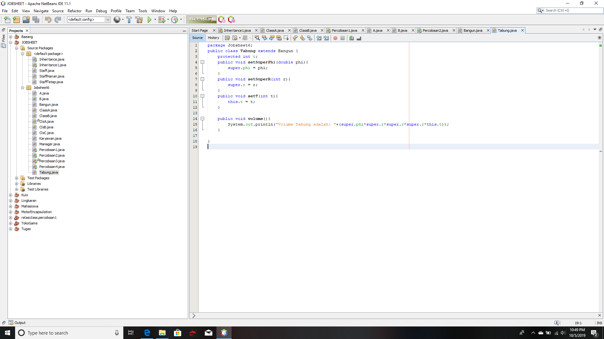
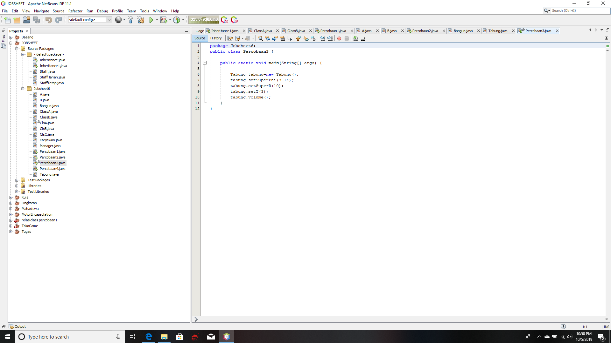

# Laporan Praktikum #6 - Inheritance

## Kompetensi
1. Memahami konsep dasar inheritance atau pewarisan
2. Mampu membuat suatu subclass dari suatu superclass tertentu
3. Mampu mengimplementasikan konsep single dan multilevel inheritance
4. Mampu membuat objek dari suatu subclass dan melakukan pengaksesan terhada atribut 
   dan method baik yang dimiliki sendiri atau turunan dari superclass nya.

## Ringkasan Materi

 Inheritance atau pewarisan sifat merupakan suatu cara untuk menurunkan suatu class yang lebih umum menjadi suatu class yang lebih spesifik. Inheritance adalah salah satu ciri utama suatu bahasa program yang berorientasi pada objek inti dari pewarisan adalah sifat reusable dari konsep object oriented. Setiap subclas akan "mewarisi" sifat dari superclass selama bersifat protected ataupun public.

 Dalam Inheritance terdapat dua istilah yang sering digunakan. Kelas yang menurunkan disebut kelas dasar, sedangkan class yang diturunkan disebut kelas turunan

 Karakteristik pada super class akan dimilki juga oleh subclassnya. terdapat 3 bentuk pewarisan yaitu; single heritance, multilevel heritance, dan multiple heritance.

## Praktikum

### Percobaan 1 (extends)

A. TAHAPAN PERCOBAAN

1. Buatlah sebuah class parent/dengan nama ClassA.java

[ini  link ke kode program](../../src/6_Inheritance/A.java)

2. Buatlah sebuah class anak/subclass dengan nama ClassB.java

link kode program : [ini link ke kode program](../../src/6_Inheritance/B.java)

3. Buatlah class Percobaan1.java untuk menjalankan program !

[ini  link ke kode program](../../src/6_Inheritance/Percobaan1.java)

4. Jalankan program diatas, kemudian amati apa yang terjadi!

## Pertanyaan

1. Pada percobaan 1 diatas program yang dijalankan terjadi error, kemudian perbaiki sehingga program tersebut bisa di jalankan dan tidak error !
Jawab: program yang dijalankan terjadi error dikarenakan program tersebut tidak bisa memamggil orang tua anak ingin memanggil orang tua nya , jika menambahkan extends maka si anak bisa memanggil orang tua nya

2. Jelaskan apa penyebab program pada percobaan 1 ketika dijalankan terdapat error !
Jawab: karena tidak terdapat extends yang memanggil orang tua nya

### Percobaan 2 (Hak Akses)

1. Buatlah sebuah class parent/superclass dengan nama ClassA.java

[ini  link ke kode program](../../src/6_Inheritance/ClassA.java)

2. Buatlah sebuah class anak/subclass dengan nama ClassB.java

[ini  link ke kode program](../../src/6_Inheritance/ClassB.java)

3. Buatlah class Percobaan2.java untuk menjalankan program diatas!

[ini  link ke kode program](../../src/6_Inheritance/Percobaan2.java)

4. Jalankan program diatas, kemudian amati apa yang terjadi!

## Pertanyaan
1. Pada Percobaan 2 di atas program yang di jalankan terjadi error, kemudian perbaiki sehingga program tersebut bisa dijalankan dan tidak error!
Jawab : Program tersebut error di karenakan program tersebut belum diberikan hak akses di dalam class masih terdapat private class maka terjadi error

2. Jelaskan apa penyebab program pada percobaan 2 ketika dijalankan terdapat error!
Jawab: dikarenakan belum terdapat hak akses atau masih private di dalam method sehingga untuk menampilkan terjadi error 

### Percobaan 3 (super)

1. Buatlah sebuah class parent/superclass dengan nama Bangun.java

[ini  link ke kode program](../../src/6_Inheritance/Bangun.java)

2. Buatlah class anak/subclass dengan nama Tabung.java

[ini  link ke kode program](../../src/6_Inheritance/Tabung.java)

3. Buatlah class Percobaan3.java untuk menjalankan program diatas

[ini  link ke kode program](../../src/6_Inheritance/Percobaan3.java)

4. Jalankan Program diatas!

### Pertanyaan 

1. Jelaskan fungsi "super" pada potongan program berikut di class Tabung !

a. super.phi = phi ;
Jawab: Mengakses phi dalam Tabung

b. super.r = r;
Jawab: Mengakses fungsi r dalam Tabung

2. Jelaskan fungsi "super" dan "this" pada potongan program berikut di class Tabung!
super.phi+ super.r"this t;
Jawab: Memanggil konstruktor berparameter di class Tabung

3. Jelaskan mengapa pada class Tabung tidak dideklarasikan atribut "phi" dan "r" tetapi class tersebut dapat mengakses atribut tersebut!
Jawab: karena atribut tersebut berparameter

### Percobaan 4 (super constructor)

1. Buatlah tiga file dengan nama ClassA.java, ClassB.jav, dan ClassC.java, seperti kode program di bawah ini 

ClassA.java

[ini  link ke kode program](../../src/6_Inheritance/ClsA.java)

ClassB.java

[ini  link ke kode program](../../src/6_Inheritance/ClsB.java)

ClassC.java

[ini  link ke kode program](../../src/6_Inheritance/ClsC.java)

2. Buatlah class Percobaan4.java untuk menjalankan program diatas!

[ini  link ke kode program](../../src/6_Inheritance/Percobaan4.java)

3. Jalankan program kemudian amati apa yang terjadi!

### Pertanyaan

1. Pada percobaan 4 sebutkan mana class yang termasuk superclass dan subclass, kemudian jelaskan alasanya !
Jawab: Yang termasuk superclass yaitu CLS C dan sub class nya terdiri dari CLS A dan B

2. Ubahlah isi konstruktor default ClassC seperti berikut:

Tambahkan kata super() di baris dalam konstruktor defaultnya. Coba jelaskan kembali class Percobaan4.java dan terlihat tidak ada perbedaan dari hasil outputnya!

3. Ubahlah isi konstruktor default ClassC seperti berikut:

Ketika mengubah posisi super() dibaris kedua dalam konstruktor defaultnya dan terlihat ada error. Kemudian kembalikan super() kebaris pertama seperti sebelumnya, maka errornya akan hilang.

Jelaskan bagaimana urutan proses jalanya konstruktor saat objek test dibuat!

4. Apakah fungsi super() pada potongan program di bawah ini di Class C!
Jawab : Yaitu untuk memanggil orang tua nya 

### Percobaan 5 

a. Buatlah kelas Karyawan

[ini  link ke kode program](../../src/6_Inheritance/Karyawan.java)

b. Buatlah class Manager

[ini  link ke kode program](../../src/6_Inheritance/Manager.java)

c. Buatlah class Staff

[ini  link ke kode program](../../src/6_Inheritance/Staff.java)

d. Buatlah class Inheritance1

[ini  link ke kode program](../../src/6_Inheritance/Inheritance.java)

e. Jalankan program, maka tampilanya sebagai berikut

### Pertanyaan

1. Sebutkan class mana yang termasuk super class dan sub class dari percobaan satu
Jawab : untuk super class yaitu Karyawan sedangkan sub class nya staff dan Manager

2. Kata kunci apakah yang digunakan untuk menurunkan suatu class ke class yang lain
Jawab: Super()

3. Perhatikan kode program pada class Manager, atribut apa saja yang dimilki oleh class tersebut? sebutkan atribut mana saja yang diwarisi dari class Karyawan!
Jawab: Yaitu Tunjangan

4. Jelaskan kata kunci super pada potongan program di bawah ini yang terdapat pada class
Jawab : memanggil konstruktor dan menjumlahkan gaji dan tunjangan dan menjadi total Gaji

5. Program percobaan 1 diatas termasuk dalam jenis inheritance apa? Jelaskan alasanya'
Jawab: temasuk inheritance super karena di setiap sub class nya terdapat konstruktor 

### Percobaan 6
A. Tahapan Percobaan

1. Perhatikan diagram class di bawah ini

2. Berdasarkan program yang sudah anda buat pada percobaan 1 sebelumnya tembahkan dua class yaitu class StaffTetap dan class StaffHarian. kode program adalah sebagai berikut 

[ini  link ke kode program](../../src/6_Inheritance/StaffTetap.java)

[ini  link ke kode program](../../src/6_Inheritance/StaffHarian.java)

3. Setelah membuat dua class di atas kemudian edit class di atas kemudian edit class inheritance 1 java sebagai berikut

[ini  link ke kode program](../../src/6_Inheritance/Inheritance1.java)

### Pertanyaan

1. Berdasarkan class di atas yang temasuk single inheritance dan mana yang temasuk multi inheritance?
Jawab : Single Inheritance: Golongan dan Asuransi
Multi inheritance: Gaji, Nama, Alamat Umur

2. Perhatikan kode program class StaffTetap dan StaffHarian, atribut apa saja yang dimiliki oleh class tersebut? sebutkan atribut mana saja yang diwarisi dari class Staff!
Jawab: Nama, Alamat, Umur, jenis kelamin

3. apakah fungsi potongan program beikut pada class Staff Harian
Jawab : membuat konstruktor pada nama, alamat, jk, umur, gaji, lembur, potongan

4. Apakah fungsi potongan program berikut pada class StaffHarian ();
memanggil data staff dari class staff

9. perhatikan kode program dibawah ini yang terdapat pada class StaffTetap
karena bersifat public dan tidak private

### 10. TUGAS

1. Buatlah sebuah program dengan konsep pewarisan sperti pada class diagram berikut ini kemudian buatlah intasiasi objek untuk menampilkan data pada class Mac, Windows dan Pc!

[ini  link ke kode program](../../src/6_Inheritance/Laptop.java)

[ini  link ke kode program](../../src/6_Inheritance/Komputer.java)

## Kesimpulan
saya dapat memahami kelas penurunan yaitu inheritance dan memanggil dari sub class ke class class nya 

## Pernyataan Diri

Saya menyatakan isi tugas, kode program, dan laporan praktikum ini dibuat oleh saya sendiri. Saya tidak melakukan plagiasi, kecurangan, menyalin/menggandakan milik orang lain.

Jika saya melakukan plagiasi, kecurangan, atau melanggar hak kekayaan intelektual, saya siap untuk mendapat sanksi atau hukuman sesuai peraturan perundang-undangan yang berlaku.

Ttd,

***(Alief Faizal Imansyah)***