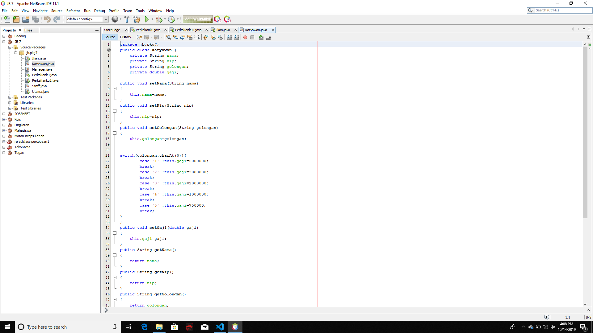
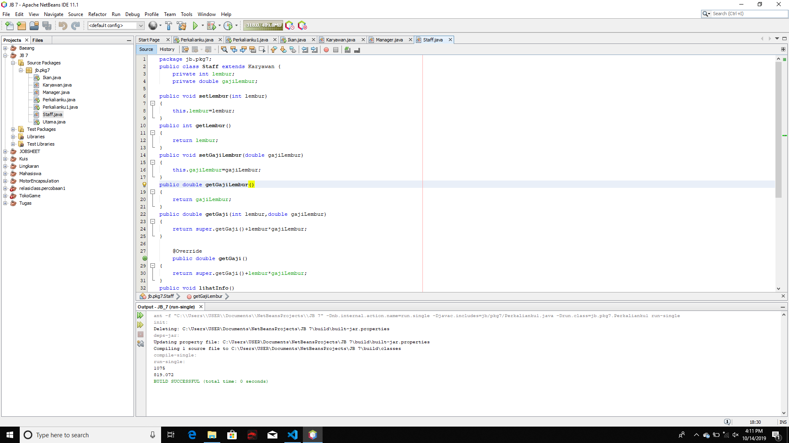
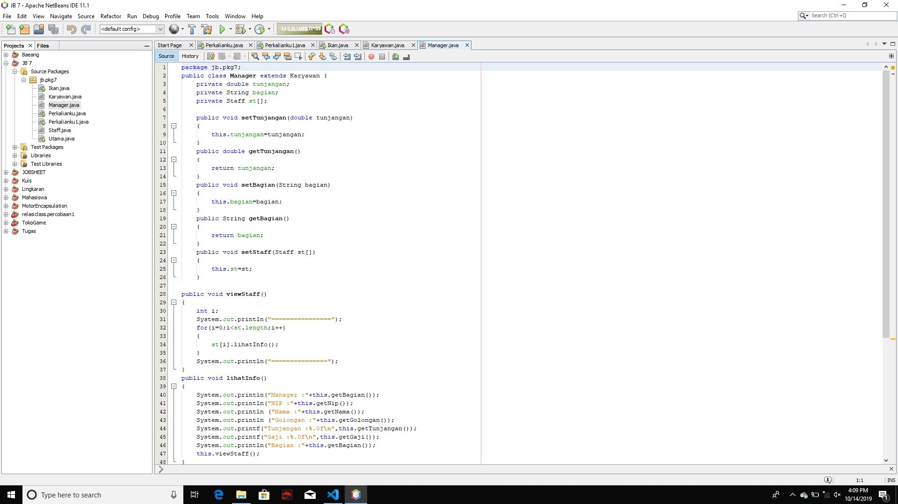
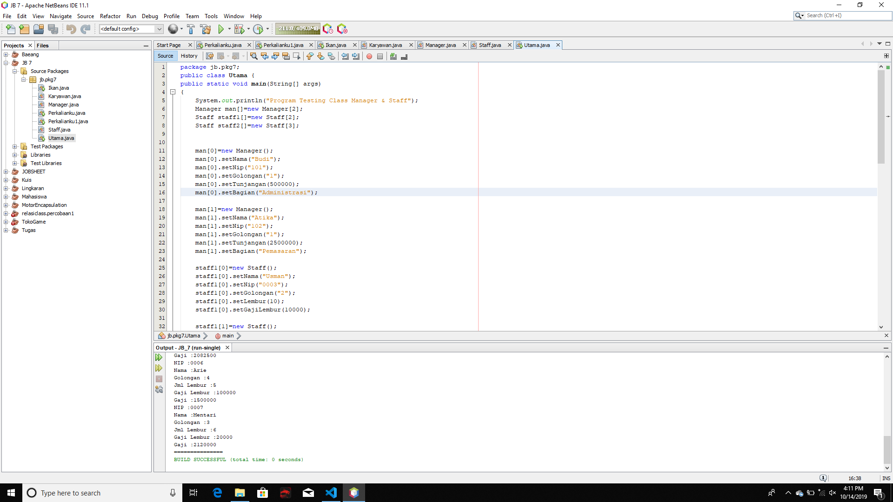
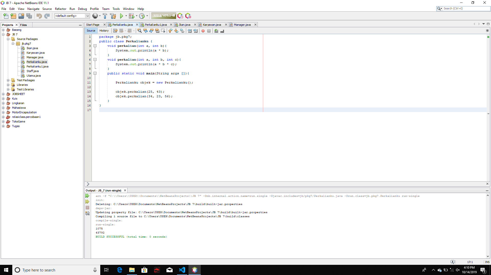
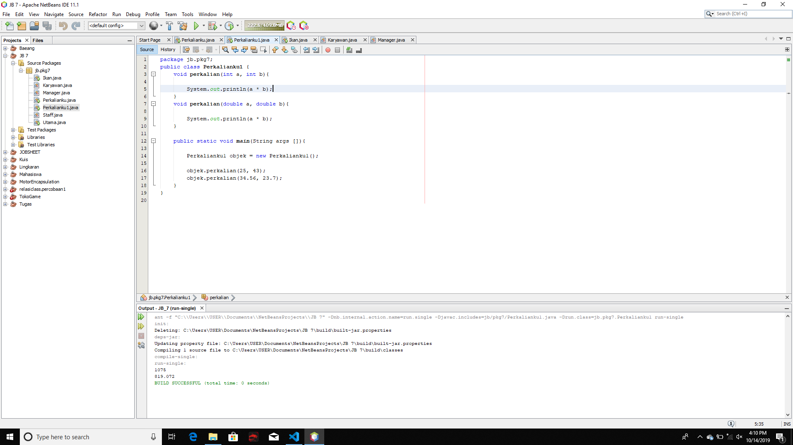
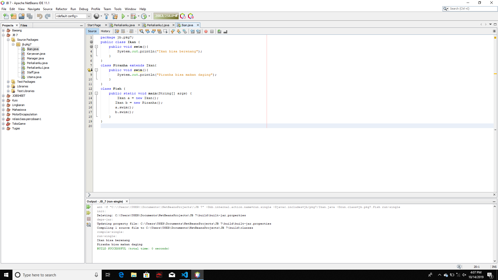

# Laporan Praktikum #7 - Overloading dan Overriding

## Kompetensi
1. Memahami konsep overloading dan overriding
2. Memahami perbedaan overloading dan overriding
3. Ketepatan dalam mengidentifikasi method overriding dan overloading
4. Ketepatan dalam mempraktekkan intruksi pada jobsheet
5. Mengimplemetasikan method overloading dan overriding

## Ringkasan Materi

## 2.1 Overloading
adalah menuliskan kembali method dengan nama yang sama pada suatu class. Tujuanya dapat memudahkan penggunaan pemanggilan method dengan fungsionalitas yang mirip. Untuk pendeklarasian method Overloading sebagai berikut:
- Nama method harus sama
- Daftar parameter harus berbeda.
- Return type boleh sama, juga boleh berbeda

## 2.2 Overriding
adalah subclass yang berusaha memodifikasi tingkah laku yang diwarisi dari superclass. Tujuanya subclass dapat memiliki tingkah laku yang lebih spesifik sehingga dapat dilakukan dengan cara mendeklarasikan kembali method milik parent class di subclass. Deklarasi method pada subclass harus sama dengan yang terdapat di super class.
Kesamaan pada:
- Nama
- Return type (untuk return type: A class atau merupakan subclass dari class A)
- Daftar parameter (jumlah, dan urutan)

## 3 Praktikum

### 3.1 Percobaan 1

Untuk kasus contoh berikut ini, terdapat tiga kelas, yaitu Karyawan, Manager, dan Staff Class Karyawan merupakan superclass dari Manager dan Staff dimana subclass Manager dan Staff memiliki method untuk menghitung gaji yang berbeda.

! [ini  link ke kode program](../../src/7_Overriding_dan_Overheading/Karyawan.java)

! [ini  link ke kode program](../../src/7_Overriding_dan_Overheading/Staff.java)

! [ini  link ke kode program](../../src/7_Overriding_dan_Overheading/Manager.java)

! [ini  link ke kode program](../../src/7_Overriding_dan_Overheading/Utama.java)

## 4 Latihan

! [ini  link ke kode program](src/7_Overriding_dan_Overheading/Perkalianku.java)

4.1 Dari source coding diatas terletak dimanakah overloading?
Jawab : terletak di void perkalian(int a, int b)

4.2 Jika terdapat overloading ada berapa jumlah parameter yang berbeda?
Jawab : ada dua yaitu
void perkalian(int a, int b) dan
void perkalian(int a, int b, int c)

! [ini  link ke kode program](src/7_Overriding_dan_Overheading/Perkalianku1.java)

4.3 Dari source coding diatas terletak dimanakah overloading?
Jawab : void perkalian(double a, double b)

4.4 Jika terdapat overloading ada berapa tipe parameter yang berbeda?
Jawab: ada satu yaitu System.outprintln(a*b)

! [ini  link ke kode program](src/7_Overriding_dan_Overheading/Ikan.java)

4.5 Dari source coding diatas terletak dimanakah overriding?
Jawab: terletak di Ikan a = new Ikan();
dan Ikan b = new Piranha ();

4.6 Jabarkanlah apabila sourcoding diatas jika terdapat overriding?
Jawab : ada terdapat di class Fish yaitu ikan a dan ikan b

## 5. Tugas

5.1 Overloading
Implementasikan konsep overloading pada class diagram di bawah ini:

## Kesimpulan
saya dapat memahami overloading dan overriding dalam pengerjaan jobsheet saya menemukan masalah dalam class Ikan ketika kedua nya public maka terjadi error, dan untuk solusi nya adalah menghilangkan public di class kedua 

## Pernyataan Diri

Saya menyatakan isi tugas, kode program, dan laporan praktikum ini dibuat oleh saya sendiri. Saya tidak melakukan plagiasi, kecurangan, menyalin/menggandakan milik orang lain.

Jika saya melakukan plagiasi, kecurangan, atau melanggar hak kekayaan intelektual, saya siap untuk mendapat sanksi atau hukuman sesuai peraturan perundang-undangan yang berlaku.

Ttd,

***(Alief Faizal Imansyah)***