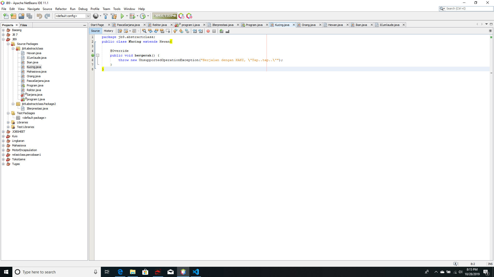
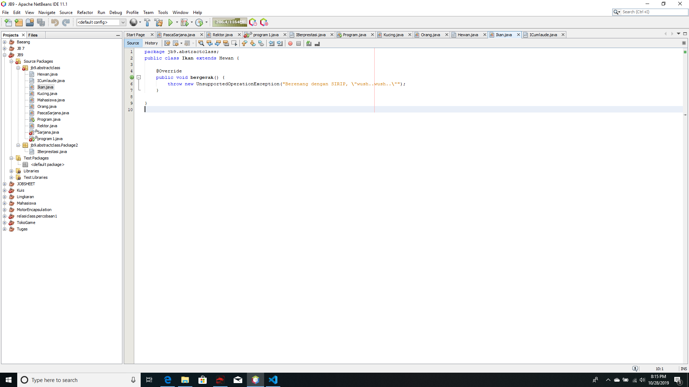
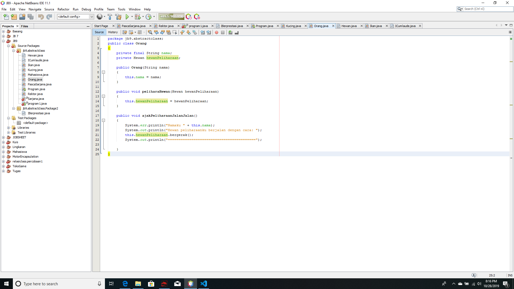
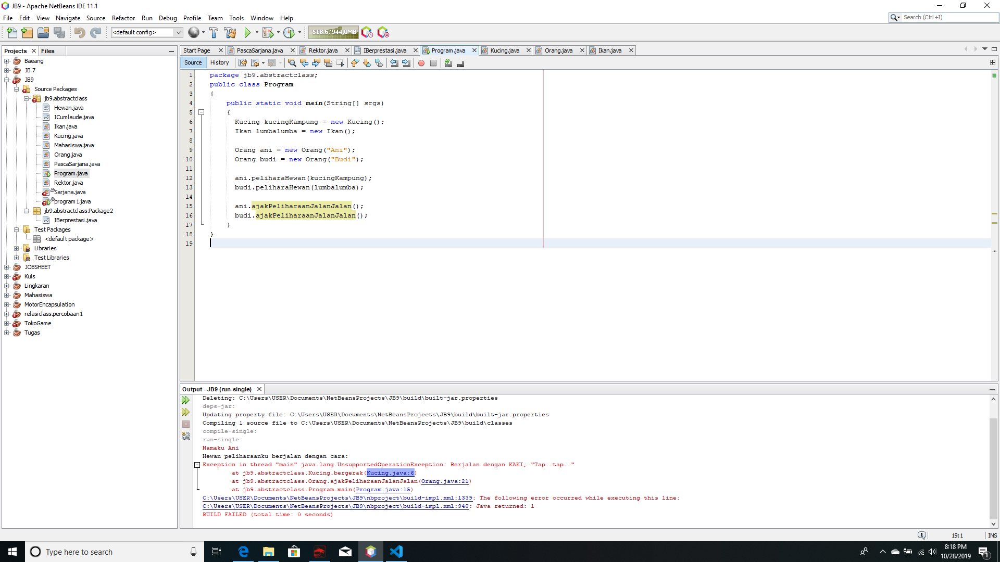
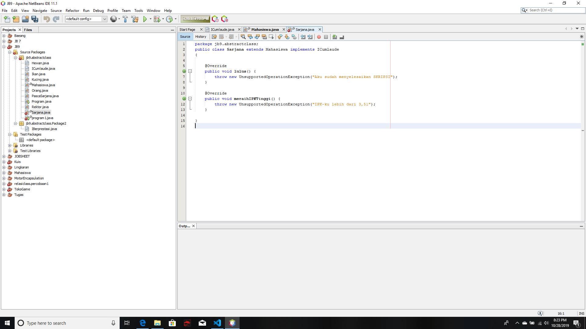
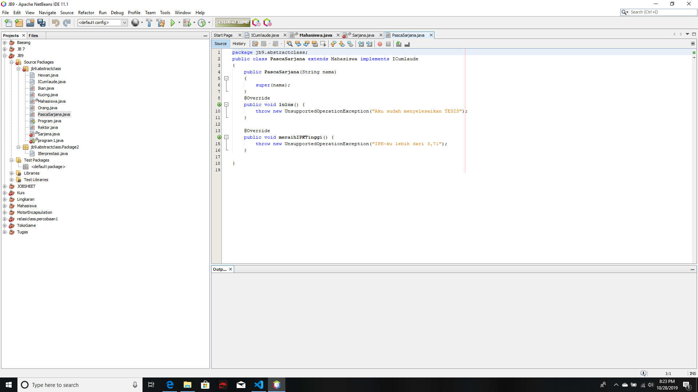
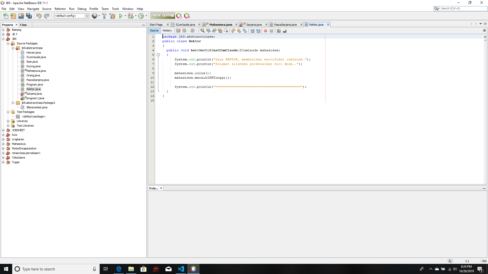
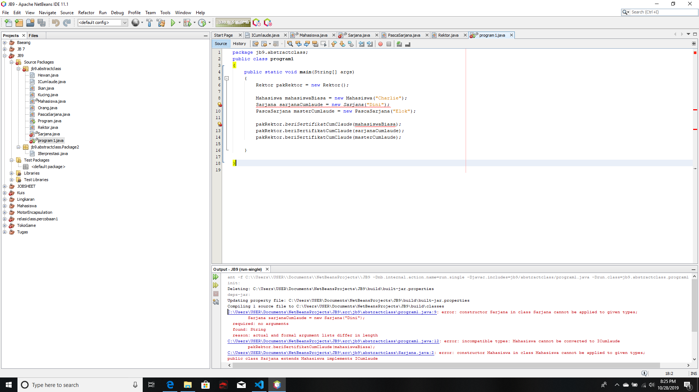

# Laporan Praktikum #10 - Polimorfisme

## Kompetensi
Setelah melakukan percobaan pada jobsheet ini, diharapkan mahasiswa mampu:
a. Memahami konsep dan bentuk dasar polimorfisme
b. Memahami konsep virtual method invication
c. Menerapkan polimorfisme pada pembuatan heterogeneous collection
d. Menerapkan polimorfisme pada parameter/argument method
e. Menerapkan object casting untuk mengubah bentuk objek

## Ringkasan Materi
Polimorfisme merupakan kemampuan suatu objek untuk memilki banyak bentuk. Penggunaan polimorfisme yang paling umum dalam OOP terjadi ketika ada referensi super class yang di gunakan untuk merujuk ke objek yang di deklarasikan dari super class, maka objek tersebut bisa dinstansiasi sebagai objek dari sub class.

Selain pada class-class yang memilki relasi inheritance, polimorfisme juga diterapkan pada interface. Ketika objek yang dideklarasikan dari suatu interface, maka ia bisa digunakan untuk mereferensi ke objek dari class-class yang implements ke interface tersebut.

## 4 Praktikum

### Percobaan 1 Bentuk dasar polimorfisme

! [ini  link ke kode program](../../src/7_Overriding_dan_Overheading/Hewan.java)

! [ini  link ke kode program](../../src/7_Overriding_dan_Overheading/Kucing.java)

! [ini  link ke kode program](../../src/7_Overriding_dan_Overheading/Ikan.java)

! [ini  link ke kode program](../../src/7_Overriding_dan_Overheading/Orang.java)

! [ini  link ke kode program](../../src/7_Overriding_dan_Overheading/Program.java)

### Percobaan 2 Interface
Pada sebuah wisuda, seorang Rektor akan memberikan penghargaan sertifikat Cumlaude pada semua mahasiswa yang memenuhi persyaratan. Persyaratan agar seorang mahasiswa dapat disebut sebagai Cumlaude berbeda-beda antara mahasiswa Sarjana dan Pasca Sarjana
Untuk menjadi cumlaude, mahasiswa Sarjana harus mengerjakan skripsi dan memiliki IPK lebih tinggi dari 3,51. Sedangkan untuk mahasiswa Pasca Sarjana, mereka harus mengerjakan tesis dan meraih IPK lebih tinggi dari 3,71. Pada percobaan ini kita akan mencoba menerjemahkan skenario di atas ke dalam sebuah aplikasi sederhana yang memanfaatkan interface. 

! [ini  link ke kode program](../../src/7_Overriding_dan_Overheading/Sarjana.java)

! [ini  link ke kode program](../../src/7_Overriding_dan_Overheading/PascaSarjana.java)

! [ini  link ke kode program](../../src/7_Overriding_dan_Overheading/Rektor.java)

! [ini  link ke kode program](../../src/7_Overriding_dan_Overheading/Program1.java)

a. Mengapa pada langkah nomor 9 terjadi error? Jelaskan!
Jawab: Karena belum terdapat konstruktor 
b. Dapatkah method kuliahDiKampus() dipanggil dari objek sarjanaCumlaude di class Program? Mengapa demikian? 
c. Dapatkah method kuliahDiKampus() dipanggil dari parameter mahasiswa di method beriSertifikatCumlaude() pada class Rektor? Mengapa demikian? 
d. Modifikasilah method beriSertifikatCumlaude() pada class Rektor agar hasil eksekusi class Program menjadi seperti berikut ini: 

## Kesimpulan
saya memahami tentang abstract class dan interface mampu membuat class dan menginstansiasi class, mohon maaf untuk jobsheet kali ini saya kurang dikarenakan posisi sedang sakit demam dan kurang maksimal dalam mengerjakan masih banyak terdapat error

## Pernyataan Diri

Saya menyatakan isi tugas, kode program, dan laporan praktikum ini dibuat oleh saya sendiri. Saya tidak melakukan plagiasi, kecurangan, menyalin/menggandakan milik orang lain.

Jika saya melakukan plagiasi, kecurangan, atau melanggar hak kekayaan intelektual, saya siap untuk mendapat sanksi atau hukuman sesuai peraturan perundang-undangan yang berlaku.

Ttd,

***(Alief Faizal Imansyah)***