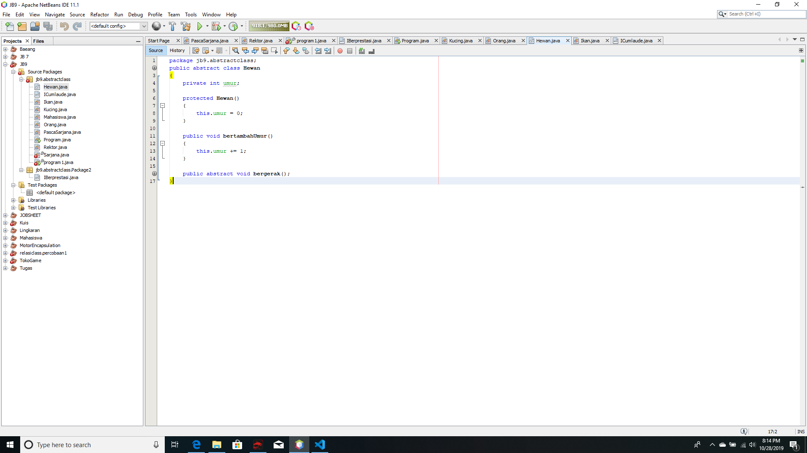

# Laporan Praktikum #9 - Abstract Class dan Interface

## Kompetensi
Setelah menyelesaikan lembar kerja ini mahasiswa diharapkan mampu:
1. Menjelaskan maksud dan tujuan penggunaan Abstract Class;
2. Menjelaskan maksud dan tujuan penggunaan Interface;
3. Menerapkan Abstract Class dan Interface di dalam pembuatan program.

## Ringkasan Materi

## Abstract Class
Abstract Class adalah class yang tidak dapat diinstansiasi namun dapat dapat di-extend. Abstract class baru dapat dimanfaatkan ketika ia di-extend.

## Karakteristik:
a. Dapat memiliki properties dan methods seperti class biasa.
b. Selalu memiliki methods yang tidak memiliki tubuh(hanya deklarasi nya saja), disebut juga abstract method
c. Selalu dideklarasikan dengan menggunakan kata kunci abstract class.

## Interface
Interface adalah struktur data yang hanya berisi abstract methods.Tidak ada apa-apa selain method abstract pada interface, termasuk atribut getter dan setter.

## Karakteristik:
a. Tidak ada apa-apa di dalamnya selain abstract class
b. Di konvensi bahasa pemograman Java, namanya dianjurkan untuk selalu diawali dengan huruf kapital 'I'.
c. Selalu dideklarasikan dengan menggunakan kata kunci interface
d. Diimplementasikan dengan menggunakan kata kunci implements.

## 3 Praktikum

### Percobaan 1 Abstract class

Di dunia ini terdapat banyak jenis hewan. Semua hewan memiliki beberapa karakteristik yang sama, seperti contohnya semua hewan memiliki umur, hewan apapun itu, umurnya akan bertambah sama jumlahnya setiap tahun. Selain karakteristik yang sama, masing-masing hewan juga memiliki karakteristik yang berbeda satu dengan yang lainnya. Contohnya dalam hal bergerak. Cara kucing bergerak berbeda dengan cara ikan bergerak. Kucing bergerak dengan cara melangkahkan kaki-kakinya sedangkan ikan bergerak dengan cara menggerakkan siripnya. 

! [ini  link ke kode program](../../src/7_Overriding_dan_Overheading/Hewan.java)

! [ini  link ke kode program](../../src/7_Overriding_dan_Overheading/Kucing.java)

! [ini  link ke kode program](../../src/7_Overriding_dan_Overheading/Ikan.java)

! [ini  link ke kode program](../../src/7_Overriding_dan_Overheading/Orang.java)

! [ini  link ke kode program](../../src/7_Overriding_dan_Overheading/Program.java)

### Percobaan 2 Interface
Pada sebuah wisuda, seorang Rektor akan memberikan penghargaan sertifikat Cumlaude pada semua mahasiswa yang memenuhi persyaratan. Persyaratan agar seorang mahasiswa dapat disebut sebagai Cumlaude berbeda-beda antara mahasiswa Sarjana dan Pasca Sarjana
Untuk menjadi cumlaude, mahasiswa Sarjana harus mengerjakan skripsi dan memiliki IPK lebih tinggi dari 3,51. Sedangkan untuk mahasiswa Pasca Sarjana, mereka harus mengerjakan tesis dan meraih IPK lebih tinggi dari 3,71. Pada percobaan ini kita akan mencoba menerjemahkan skenario di atas ke dalam sebuah aplikasi sederhana yang memanfaatkan interface. 

! [ini  link ke kode program](../../src/7_Overriding_dan_Overheading/Sarjana.java)

! [ini  link ke kode program](../../src/7_Overriding_dan_Overheading/PascaSarjana.java)

! [ini  link ke kode program](../../src/7_Overriding_dan_Overheading/Rektor.java)

! [ini  link ke kode program](../../src/7_Overriding_dan_Overheading/Program1.java)

a. Mengapa pada langkah nomor 9 terjadi error? Jelaskan!
Jawab: Karena belum terdapat konstruktor 
b. Dapatkah method kuliahDiKampus() dipanggil dari objek sarjanaCumlaude di class Program? Mengapa demikian? 
c. Dapatkah method kuliahDiKampus() dipanggil dari parameter mahasiswa di method beriSertifikatCumlaude() pada class Rektor? Mengapa demikian? 
d. Modifikasilah method beriSertifikatCumlaude() pada class Rektor agar hasil eksekusi class Program menjadi seperti berikut ini: 

## Kesimpulan
saya memahami tentang abstract class dan interface mampu membuat class dan menginstansiasi class, mohon maaf untuk jobsheet kali ini saya kurang dikarenakan posisi sedang sakit demam dan kurang maksimal dalam mengerjakan masih banyak terdapat error

## Pernyataan Diri

Saya menyatakan isi tugas, kode program, dan laporan praktikum ini dibuat oleh saya sendiri. Saya tidak melakukan plagiasi, kecurangan, menyalin/menggandakan milik orang lain.

Jika saya melakukan plagiasi, kecurangan, atau melanggar hak kekayaan intelektual, saya siap untuk mendapat sanksi atau hukuman sesuai peraturan perundang-undangan yang berlaku.

Ttd,

***(Alief Faizal Imansyah)***